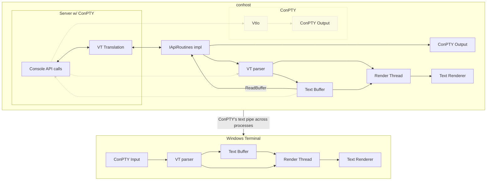

# In-process ConPTY

## tl;dr

**Why?**
* Out-of-process leads to out-of-sync issues.
* Not all Console APIs have a VT equivalent.
* Time consuming maintenance work due to poor encapsulation inside conhost.

**How?**
1. Remove `VtEngine` and translate Console API calls directly to VT.
2. Move all Console API related code from the `Host` to the `Server` project.
   Narrow the `IApiRoutines` interface down to its essentials.
   Replace relevant singletons with instances.
3. Make `Server` a standalone library with `IApiRoutines` as its primary callback interface.
   Integrate the library in Windows Terminal.
4. Ship the `Server` library as part of Windows. Build conhost itself on top of it.
   (Long term goal.)

## Why?

**Before:**


**After:**

```mermaid
%%{ init: { "flowchart": { "curve": "monotoneX" } } }%%
flowchart LR
    subgraph ConPTYlib["ConPTY (static library)"]
        server_io[Console API calls]
        ConPTY_Translation[VT Translation]

        server_io<-->ConPTY_Translation
    end

    subgraph ConPTY["ConPTY (dynamic library)"]
        ConPTY_impl[IApiRoutines impl]
        ConPTY_parser[VT parser]
        ConPTY_buffer[Text Buffer]
        ConPTY_output[ConPTY Output]

        ConPTY_Translation<-->ConPTY_impl
        ConPTY_impl-->ConPTY_parser
        ConPTY_parser-->ConPTY_buffer
        ConPTY_buffer--ReadBuffer-->ConPTY_impl
        ConPTY_impl------>ConPTY_output
    end

    subgraph conhost
        conhost_impl[IApiRoutines impl]
        conhost_parser[VT parser]
        conhost_buffer[Text Buffer]
        conhost_renderer[Render Thread]
        conhost_atlas[Text Renderer]

        ConPTY_Translation<-->conhost_impl
        conhost_impl-->conhost_parser
        conhost_parser-->conhost_buffer
        conhost_buffer--->conhost_renderer
        conhost_buffer--ReadBuffer-->conhost_impl
        conhost_renderer-->conhost_atlas
    end

    subgraph wt[Windows Terminal]
        impl[IApiRoutines impl]
        parser[VT parser]
        buffer[Text Buffer]
        renderer[Render Thread]
        atlas[Text Renderer]

        ConPTY_Translation<-->impl
        impl-->parser
        parser-->buffer
        buffer--->renderer
        buffer--ReadBuffer-->impl
        renderer-->atlas
    end
```



To extend on the [tl;dr](#tldr):
* ConPTY runs out-of-process, outside the hosting terminal, which leads to an unsolvable issue: The buffer contents between ConPTY and the terminal can go out of sync.
  * The terminal and ConPTY may implement escape sequences differently.
  * ...may implement text processing differently.
  * ...may implement text reflow (resize) differently.
  * Resizing the terminal and ConPTY is asynchronous and there may be concurrent text output.
  * ...and it may uncover text from the scrollback, which ConPTY doesn't know about.
* Since ConPTY communicates with the hosting terminal exclusively via escape sequences, it fails to cover some Console API methods that cannot be represented via VT sequences. The most basic example of this is the lack of LVB gridlines.
* As the prototype that ConPTY initially was it has fulfilled our needs a thousand times over, but it being just a layer on top of conhost has resulted in software decay. Today, ConPTY's architecture is difficult to maintain and debug. The layer boundary with existing conhost code has slowly blurred over the years which has negatively affected many places. Lastly, its performance is poor and subject to much debate. It's on us now to finally pay our debt and make ConPTY its own proper, composable component that both conhost and Windows Terminal can be built on top of.

Considerations:
* A named `MUTEX` can theoretically be used to solve parts of the out-of-sync issue, because it could be used to ensure a synchronous buffer reflow.
  However, this requires the shared lock to be acquired every time input is processed, on top of the regular console lock, which raises ABBA deadlock concerns, in particular since it requires cross-process communication while the lock is held.
  Making this setup not just hopefully but also provably robust, is likely to be very difficult.
  It also doesn't solve any of the other listed problems.
  Running ConPTY in-process on the other hand appears to be a trivial change in comparison.

## Step 1: Remove VtEngine

### Goal


### Steps

* Remove VtEngine
* Remove `--vtmode`
* Remove `--resizeQuirk`
* Add buffering to `VtIo` and hook it up to the output pipe
* Implement direct VT translations for all relevant Console APIs

### Discussion

The idea is that we can translate Console API calls directly to VT at least as well as the current VtEngine setup can. For instance, a call to `SetConsoleCursorPosition` clearly translates directly to a `CUP` escape sequence. But even complex calls like `WriteConsoleOutputAttribute` which have no VT equivalent can be implemented this way by first applying the changes to our local text buffer and then serializing the affected range back to VT. Since the Console API is extremely limited (only 16 colors, etc.), the serialization code will similarly be extremely simple. That's also how VtEngine currently works, but instead of doing it asynchronously in the renderer thread, we'll do it synchronously right during the Console API call.

The `--vtmode xterm-ascii` switch exists for the telnet client as it only supports ASCII as per RFC854 section "THE NVT PRINTER AND KEYBOARD". However, telnet is the only user of this flag and it's trivial to do there (for instance by stripping high codepoints in `WriteOutputToClient` in `telnet/console.cpp`), so there's no reason for us to keep this logic in the new code.

This change will result in a significant reduction in complexity of our architecture. VT input from the shell or other clients will be given 1:1 to the hosting terminal, which will once and for all resolve our ordering and buffering issues.

## Step 2: Move Console API implementations to Server

### Goal



### Steps

* Move the API implementation from the `Host` to the `Server` project.
* Narrow down the `IApiRoutines` interface to its essentials.
* Replace affected singletons with regular class instances.

### Discussion

This step is somewhat difficult to visualize, but the basic idea is that instead of having 3 arrows going in and out of the Server component, we got exactly 1. This makes the console server and its VT translation a proper, reusable component, which we need so that we can solve the out-of-sync issues and to support all Console APIs. To make the Server API convenient to use, the interface needs to be narrowed down to as few methods as possible. This interface is currently called `IApiRoutines`.

### API Design

> [!IMPORTANT]
> The following API design is a rough draft to convey the idea. It does not represent a complete, finished design. This document will be updated once work on the API begins and the actual requirements become clearer.

```cs
// The Console API is built around a freely addressable frame buffer. It allows you to
// address any part of the buffer, even those outside of what's considered the "viewport".
// Consequentially, ConPTY supports this and all `CONPTY_COORD`s are relative to this buffer.
// The VT viewport may be any vertical section of that console buffer. For instance:
//
//                       ┌──────────────────┐
//                       │y=-3              │
//                       │                  │    ╮
//                       │                  │    │
//                    ╭  ├──────────────────┤    ├── VT scrollback (partially addressed)
//                    │  │y=0               │    │
//                    │  │                  │  ╮ ╯
//                    │  │                  │  │
//   Console Buffer ──┤  ├──────────────────┤  ├──── VT Viewport (top y = 1)
//                    │  │y=3               │  │
//                    │  │                  │  ╯
//                    │  │                  │
//                    ╰  └──────────────────┘
//
// The good news is that nothing prevents you from giving the Console Buffer the exact
// same size as the VT Viewport and for modern terminals doing so is recommended. That way, `CONPTY_COORD`
// instances are all viewport-relative and content below/above the viewport is never addressed:
//
//                       ┌──────────────────┐    ╮
//                       │y=-3              │    │
//                       │                  │    ├── VT scrollback (unused)
//                       │                  │    │
//                    ╭  ├──────────────────┤  ╮ ╯
//                    │  │y=0               │  │
//   Console Buffer ──┤  │                  │  ├──── VT Viewport
//                    │  │                  │  │
//                    ╰  └──────────────────┘  ╯
//
// Coordinates are 0-indexed. Note that while INT32 coordinates are used by this API, coordinates below
// 0 and above 65535 are generally invalid, as the Console ABI currently uses unsigned 16-Bit integers.
//
// You should always perform input validation and return E_INVALIDARG for invalid coordinates.
struct CONPTY_COORD {
    INT32 x;
    INT32 y;
};

// These flags are also defined via Windows.h.
#if 0
// These flags are equivalent to the classic 4-bit indexed colors in VT via SGR.
// However, the order of blue and red bits are swapped. You can use the following C code to switch back and forth between
#define FOREGROUND_BLUE            0x0001 // Text color contains blue.
#define FOREGROUND_GREEN           0x0002 // Text color contains green.
#define FOREGROUND_RED             0x0004 // Text color contains red.
#define FOREGROUND_INTENSITY       0x0008 // Text color is intensified.
#define BACKGROUND_BLUE            0x0010 // Background color contains blue.
#define BACKGROUND_GREEN           0x0020 // Background color contains green.
#define BACKGROUND_RED             0x0040 // Background color contains red.
#define BACKGROUND_INTENSITY       0x0080 // Background color is intensified.

// These two bits are used to represent wide glyphs.
#define COMMON_LVB_LEADING_BYTE    0x0100 // Leading byte.
#define COMMON_LVB_TRAILING_BYTE   0x0200 // Trailing byte.

// This bit is equivalent to the "CSI 7 m" reverse video escape sequence.
#define COMMON_LVB_REVERSE_VIDEO   0x4000 // Reverse foreground and background attribute.

// NOTE: These flags have no equivalent in VT. COMMON_LVB_UNDERSCORE in particular is not the same as a
// "CSI 4 m" underline in VT, despite the name. They're used to give a cell border (= grid) lines.
#define COMMON_LVB_GRID_HORIZONTAL 0x0400 // Top horizontal.
#define COMMON_LVB_GRID_LVERTICAL  0x0800 // Left vertical.
#define COMMON_LVB_GRID_RVERTICAL  0x1000 // Right vertical.
#define COMMON_LVB_UNDERSCORE      0x8000 // Underscore.
#endif

// This struct is binary compatible to the CHAR_INFO struct from the Windows API and functionally equivalent.
//
// The following rules MUST be followed:
// * Each instance represents 1 cell in the terminal.
// * Each instance contains a single UCS-2 character.
//   Surrogate pairs and grapheme clusters are not allowed. Replace them with U+FFFD.
// * Colors that cannot be represented via the `attributes` flags can be replaced with an approximation.
//   Alternatively, `FOREGROUND_BLUE | FOREGROUND_GREEN | FOREGROUND_RED` can be used (no `BACKGROUND` bit set).
// * If a wide glyph (2 cells wide) is encountered, the following applies:
//   * Create 2 consecutive CONPTY_CHAR_INFO instances (as per the first rule).
//   * Repeat the same `character` in both instances, even if it's U+FFFD.
//   * Assign the first instance an `attributes` flag of `COMMON_LVB_LEADING_BYTE`
//     and the second one `COMMON_LVB_TRAILING_BYTE`.
//   * BUT if the request for a CONPTY_CHAR_INFO only partially intersects a wide glyph, replace the character
//     (and only the character) with U+0020 whitespace. This also means that `COMMON_LVB_LEADING/TRAILING_BYTE`
//     should not be set, because the returned character isn't wide anymore. An example:
//     If you have a red "猫" on top of a blue background in the buffer and a single `CONPTY_CHAR_INFO` is requested
//     for the left half of the glyph, then you should set `character` to whitespace and `attributes` to
//     `FOREGROUND_RED | BACKGROUND_BLUE`. Debug builds of ConPTY will assert that you do this.
//
// For more documentation about the `attributes` flags, see the constants defined above.
struct CONPTY_CHAR_INFO {
    wchar_t character;
    UINT16 attributes;
};

// NOTE: boolean is 8 Bits large.
struct CONPTY_INFO {
    HWND window;

    CONPTY_COORD bufferSize;
    CONPTY_COORD cursorPosition;
    CONPTY_COORD viewPosition;
    CONPTY_COORD viewSize;
    COLORREF colorTable[16];

    CONPTY_COORD selectionStart;
    CONPTY_COORD selectionEnd;
    boolean selectionActive;
    boolean selectionRectangular;
    boolean selectionMouseDown;

    float cursorHeight;
    boolean cursorHidden;
};

// Any item that has changed relative to the current CONPTY_INFO will be set to a non-null pointer.
// In other words, members that are null represent those that remain unchanged.
struct CONPTY_INFO_CHANGE {
    CONPTY_COORD* bufferSize;
    CONPTY_COORD* cursorPosition;
    CONPTY_COORD* viewPosition;
    CONPTY_COORD* viewSize;
    COLORREF* colorTable; // The referenced array is always 16 items large.

    float* cursorHeight;
    boolean* cursorHidden;

    [string] const wchar_t* fontName;
    UINT32* fontFamily;
    UINT32* fontWeight;
    CONPTY_COORD* fontSize;
};

interface IConsole {
    void WriteInput(const INPUT_RECORD* )
}

// First of all: You don't need to implement all functions and all structs perfectly for ConPTY to work decently well.
// For instance, if you don't implement `CONPTY_INFO::cursorHeight` properly, barely anything will happen.
interface IConsoleCallback {
    // The console server is single-threaded and no two calls will be made simultaneously. These two functions
    // simply allow you to synchronize the calls down below if your application is multi-threaded.
    //
    // Lock() will always be called before any of the functions below are called.
    // Lock() and Unlock() do not need to support recursive locking.
    HRESULT Lock();
    HRESULT Unlock();

    // This function gets a snapshot of the terminal state.
    //
    // You must ensure that the returned pointer stays valid until the next GetInfo() or Unlock() call.
    // You don't need to return a new instance on each call. ConPTY will only use the last returned pointer.
    // You don't need to keep the CONPTY_INFO struct constantly up to date, but you're allowed to.
    //   For instance, it's valid to change the CONPTY_COORD::cursorPosition field when SetCursorPosition() is called.
    //   But changing the CONPTY_INFO struct concurrently is not permitted. The previous call to Lock() is expected to lock the terminal.
    //
    // In short, it's recommended to have just a single CONPTY_INFO instance in your implementation,
    // which you keep alive forever, and which you simply update whenever GetInfo() is called.
    //
    // It's recommended that this function is fast as it will be called relatively often.
    // One possible technique to do so is to keep most fields constantly up-to-date (e.g. the `bufferSize`),
    // while updating those that change very often only once this method is called (e.g. the `cursorPosition`).
    const CONPTY_INFO* GetInfo();

    // In short, when this method is called you're asked to apply any non-null member of the given CONPTY_INFO_CHANGE
    // struct to the terminal. For instance a non-null `.cursorPosition` is identical to calling `SetCursorPosition`,
    // a non-null `.bufferSize` is a request to resize the terminal, and so on.
    HRESULT SetInfo([in] const CONPTY_INFO_CHANGE* info);

    // Starting from column `pos.x` in row `pos.y`, this reads `columns`-many characters and attributes.
    // `pos` and `columns` will be clamped such that reads never extend outside of the `CONPTY_INFO::bufferSize`.
    //
    // However, it may still read cells that have never been written to (for instance below the current viewport!).
    // Such reads should not fail. Simply fill the `infos` array with whitespaces and a default attribute of your chosing,
    // but `FOREGROUND_BLUE | FOREGROUND_GREEN | FOREGROUND_RED` is recommended (no other bits set).
    HRESULT ReadBuffer([in] CONPTY_COORD pos, [in] INT32 columns, [out, length_is(columns)] CONPTY_CHAR_INFO* infos);

    // Starting from column `pos.x` in row `pos.y`, this reads `columns`-many characters and attributes.
    // `pos` and `columns` will be clamped such that reads never extend outside of the `CONPTY_INFO::bufferSize`.
    //
    // However, it may still read cells that have never been written to (for instance below the current viewport!).
    // Such reads should not fail. Simply fill the `infos` array with whitespaces and a default attribute of your chosing,
    // but `FOREGROUND_BLUE | FOREGROUND_GREEN | FOREGROUND_RED` is recommended (no other bits set).
    HRESULT ReadBuffer([in] CONPTY_COORD pos, [in] INT32 columns, [out, length_is(columns)] CONPTY_CHAR_INFO* infos);

    // As explained in the CONPTY_COORD documentation, ConPTY coordinates may be outside of the VT viewport.
    // This function is necessary in order to support this. If you assign the console buffer the same size
    // as the VT viewport, `pos` can be translated to VT using `printf("\x1b[%d;%dC", pos.y + 1, pos.x + 1)`.
    HRESULT SetCursorPosition([in] CONPTY_COORD pos);

    // The Console API's supports 4 gridline attributes which cannot be translated to VT.
    // This function is necessary in order to support this. If you don't plan to support those gridlines,
    // you can translate the attributes to VT with the following code or some equivalent:
    //   static const uint8_t lut[] = { 30, 34, 32, 36, 31, 35, 33, 37, 90, 94, 92, 96, 91, 95, 93, 97 };
    //   const auto fg = lut[attributes & 0xf];
    //   const auto bg = lut[(attributes >> 4) & 0xf] + 10;
    //   printf("\x1b[{};{}m", fg, bg);
    // You may also choose to support COMMON_LVB_REVERSE_VIDEO, which translates to `printf("\x1b[7m")`.
    HRESULT SetCurrentAttributes([in] UINT16 attributes);

    // Starting from column `pos.x` in row `pos.y`, this reads `count`-many characters and attributes.
    // `pos` and `count` will be clamped such that reads never extend outside of the `CONPTY_INFO::bufferSize`.
    //
    // However, it may still read cells that have never been written to (for instance below the current viewport!).
    // Such reads should not fail. Simply fill the `infos` array with whitespaces and a default attribute of your chosing,
    // but `FOREGROUND_BLUE | FOREGROUND_GREEN | FOREGROUND_RED` is recommended (no other bits set).
    HRESULT ReadBuffer([in] CONPTY_COORD pos, [in] INT32 count, [out, length_is(count)] CONPTY_CHAR_INFO* infos);

    // Starting from column `pos.x` in row `pos.y`, this write `count`-many characters and attributes.
    // `pos` and `count` will be clamped such that writes never extend outside of the `CONPTY_INFO::bufferSize`.
    HRESULT WriteBuffer([in] CONPTY_COORD pos, [in] INT32 count, [out, length_is(count)] CONPTY_CHAR_INFO* infos);

    // UTF8 and UTF16 are both widely used text encodings on Windows and it's recommended that both functions are reasonably fast.
    // ConPTY will translate all non-Unicode text to UTF16 for you.
    // You must validate incoming text. It's recommended to replace invalid codepoints with U+FFFD.
    // You don't need to check for broken up codepoints at the start/end of the text, because ConPTY will handle that for you.
    HRESULT WriteUTF8([in, string, length_is(count)] const char* text, [in] DWORD count);
    HRESULT WriteUTF16([in, string, length_is(count)] const wchar_t* text, [in] DWORD count);
};
```

## Step 3: Productize Server

### Goal


## Step 4: Ship Server in Windows
